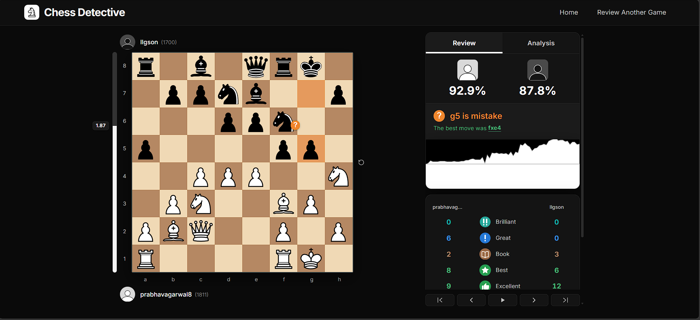
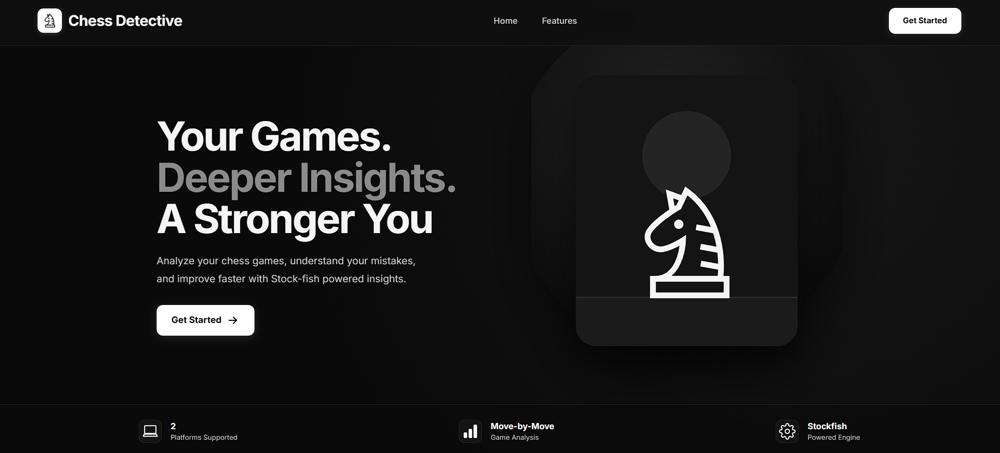
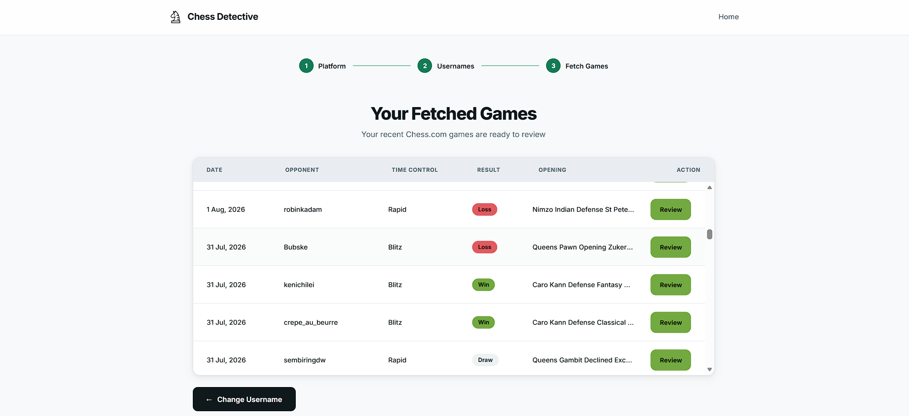
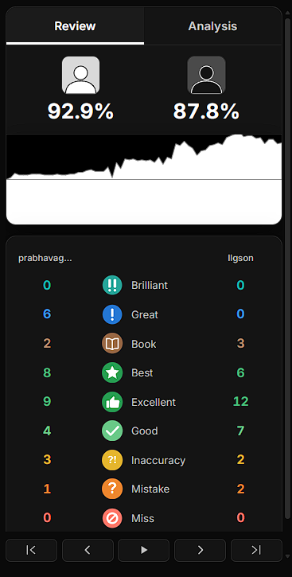
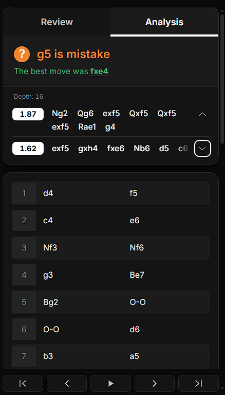

# ♟️ Chess Detective

> A browser-based chess analysis platform that investigates your games: it imports them from Chess.com or Lichess, analyzes every position with Stockfish, and explains what happened move by move.

[](https://chessdetective.vercel.app)
[](#-release)
[](#-license)



## Overview

Most analysis tools tell players **what the engine thinks**. Chess Detective is built around a different goal: **investigate the game and understand where things changed.**

Enter a username, pick a recent game, and Stockfish analyzes it locally in your browser through **WebAssembly** and a **Web Worker**. Raw engine output is then processed into move classifications, accuracy scores, opening information, engine lines, and critical moments.

Instead of only showing _"Stockfish says this move is -1.8"_, the review tries to answer:

- What happened here?
- How good was the move?
- What did the engine prefer instead?
- Where did the game change direction?

## Contents

- [Features](#-features)
- [Tech Stack](#-tech-stack)
- [Architecture](#-architecture)
- [Project Structure](#-project-structure)
- [How Analysis Works](#-how-analysis-works)
- [Move Classification](#-move-classification)
- [Accuracy](#-accuracy)
- [Design Decisions](#-design-decisions)
- [Performance](#-performance)
- [Error Handling](#-error-handling)
- [Data and Privacy](#-data-and-privacy)
- [Limitations](#-limitations)
- [Testing](#-testing)
- [Getting Started](#-getting-started)
- [Deployment](#-deployment)
- [Roadmap](#-roadmap)
- [Release](#-release)

## 📸 Screenshots

| Landing Page                               | Game Selection                                      | Game Review                                   |
| ------------------------------------------ | --------------------------------------------------- | --------------------------------------------- |
|  |  |  |

| Move Classification                                      | Engine Lines                                    |
| -------------------------------------------------------- | ----------------------------------------------- |
|  |  |

## 🎥 Demo Video

A 1:34 walkthrough of Chess Detective, from importing a game to reviewing its Stockfish-powered analysis.

[▶️ Watch the Chess Detective Demo](https://youtu.be/bk1xv9qv7NQ)

## ✨ Features

### 🎮 Game Import

- Import recent games from **Chess.com** and **Lichess** by username
- Select a game from the fetched list
- Handles API failures and unavailable game data gracefully
- Month/year rollover when fetching Chess.com games (games are grouped by month)

### 🔎 Move-by-Move Analysis

Every position in the selected game is analyzed individually. For each one, Chess Detective can determine:

- The engine's best move and alternative lines
- Evaluation and move quality
- Position-specific information
- Critical moments in the game

### ♟️ Stockfish Analysis

Stockfish runs locally in your browser using WebAssembly, a Web Worker, and MultiPV analysis. The Web Worker keeps intensive analysis from blocking the main UI thread.

### 🏷️ Move Classification

Moves are labeled **Book, Best, Brilliant, Great, Excellent, Good, Inaccuracy, Mistake, Blunder,** or **Miss**, each with its own icon. Classification is based on **expected score**: how much win probability a move gave up compared to the engine's best move. [Details below.](#-move-classification)

### 📊 Game Statistics

- Player information, result, move count, and opening
- Per-side accuracy based on the **Lichess accuracy methodology**
- Classification counts and critical moments

### 📈 Engine Lines

Compare the move you played with the engine's alternative recommendations. Missing secondary lines are handled gracefully instead of breaking the review screen.

### 📚 Opening Detection

Derived from the game's move sequence and a bundled opening database.

### 🖥️ Interactive Chessboard

- Previous/next and first/last navigation
- Board orientation switching
- Move classification indicators
- Engine evaluation and clickable move list

## 🛠️ Tech Stack

| Area            | Tools                                                             |
| --------------- | ----------------------------------------------------------------- |
| Frontend        | HTML5, CSS3, JavaScript, Vite                                     |
| Chess           | chess.js, Stockfish, Web Workers, WebAssembly                     |
| APIs            | Chess.com API, Lichess API                                        |
| Storage         | `sessionStorage` for transferring the selected game between pages |
| Deployment      | Vercel                                                            |
| Version control | Git, GitHub                                                       |

## 🏗️ Architecture

A lightweight MVC-inspired architecture with controllers, services, models, and views. It keeps responsibilities separated while staying appropriate for a vanilla JavaScript application.

```text
User
 │
 ▼
Views
 │
 ▼
Controllers
 │
 ▼
Services
 ├── Game/Data Services
 ├── Stockfish Service
 ├── Move Classification Service
 ├── Statistics/Accuracy Logic
 └── Opening Detection
 │
 ▼
Models / Application State
```

| Layer           | What it does in Chess Detective                                                                                                                                                                        |
| --------------- | ------------------------------------------------------------------------------------------------------------------------------------------------------------------------------------------------------ |
| **Views**       | Render the UI and nothing else: the game list, player info, chessboard, move list with classification icons, engine lines, statistics panel, and loading/error states. They contain no analysis logic. |
| **Controllers** | The glue between user and logic. They handle input (username, platform, selected game, move navigation, board flip), call the right services, update the models, and tell the views what to re-render. |
| **Services**    | All domain logic: fetch games from Chess.com/Lichess, run Stockfish in the Web Worker, convert evaluations to win percentages, classify moves, compute accuracy and statistics, and detect openings.   |
| **Models**      | Hold the data for the current flow: the selected game and players, positions (FENs), engine evaluations and lines, move classifications, statistics, and UI state such as the current move.            |

**Typical flow:**

1. On `fetchGames.html`, the user enters a username. The controller calls the game service, which fetches games from the API, and the view renders the list.
2. The selected game is passed to `gameReview.html` through `sessionStorage`.
3. The review controller sends each position to the Stockfish service. The classification, accuracy, and opening services process the results, the models are updated, and the views render the review.

## 📁 Project Structure

```text
ChessDetective/
│
├── public/
│   ├── avatars/                   # placeholder-avatar-black.svg, placeholder-avatar-white.svg
│   │
│   ├── svg/
│   │   └── classification/        # 10 icons: best, blunder, book, brilliant, excellent,
│   │                              #           good, great, inaccuracy, miss, mistake (.svg)
│   │
│   └── stockfish/                 # stockfish-19-lite-single (.js + .wasm)
│
├── src/
│   ├── assets/
│   │   └── openings/              # opening database: openings_raw.js, openings_computed.js,
│   │                              #                   logicComputingOpeningFen.js
│   │
│   ├── controllers/               # handle user actions, call services, update models and views
│   ├── models/                    # data held during the current flow (game, evals, stats)
│   ├── services/                  # game fetching, Stockfish, classification, accuracy, openings
│   ├── views/                     # render the UI: board, move list, engine lines, stats
│   ├── helpers/
│   └── config.js
│
├── index.html                     # landing page
├── fetchGames.html                # game import and selection
├── gameReview.html                # review dashboard
├── package.json
└── vite.config.js
```

## 🧠 How Analysis Works

```text
PGN
 │
 ▼
Parse Game
 │
 ▼
Generate Positions / FENs
 │
 ▼
Stockfish Analysis
 │
 ▼
Engine Evaluations + Principal Variations
 │
 ▼
Move Classification
 │
 ▼
Statistics / Accuracy
 │
 ▼
Game Review UI
```

1. **Parse.** The game's PGN is parsed and each move is replayed to generate the position (FEN) before and after it.
2. **Analyze.** Each relevant FEN is sent to Stockfish, which returns an evaluation, a best move, and principal variations.
3. **Interpret.** Evaluations are converted into win percentages, then into expected-points loss per move.
4. **Classify.** Each move receives a classification from its expected-points loss plus extra rules (Book, Great, Brilliant, Miss).
5. **Summarize.** Statistics and accuracy are computed per side and rendered in the review UI.

## ♟️ Stockfish Evaluation

Chess Detective currently uses Stockfish with a fixed search configuration for game analysis. The engine provides:

- Position evaluation
- Best move
- Principal variation
- Multiple candidate lines (MultiPV)

Centipawn evaluations are converted to a win-percentage representation using the Lichess-style formula:

```text
Win% = 50 + 50 × (2 / (1 + exp(-0.00368208 × cp)) - 1)
```

Mate evaluations are capped to a defined centipawn range before conversion, so forced mates map to near-certain win or loss without breaking the math.

## 🏷️ Move Classification

The base system uses **expected-points loss**: how much win probability the player gave up compared to the engine's best move.

| Classification | Expected points lost |
| -------------- | -------------------: |
| Best           |                    0 |
| Excellent      |               ≤ 0.02 |
| Good           |               ≤ 0.05 |
| Inaccuracy     |               ≤ 0.10 |
| Mistake        |               ≤ 0.20 |
| Blunder        |               > 0.20 |

Additional logic is used for **Book**, **Great**, **Brilliant**, and **Miss**.

Because the thresholds are based on win probability rather than raw centipawns, the same centipawn swing is judged differently in a balanced position than in an already-decided one.

## 📊 Accuracy

Game accuracy is **not** a simple average of move evaluations. Chess Detective uses a volatility-aware approach inspired by the Lichess accuracy methodology:

1. Compute the win percentage after each move
2. Slide a window across the positions
3. Measure evaluation volatility inside each window
4. Compute an accuracy score for each move
5. Weight moves by volatility, so moves in sharp positions count for more
6. Combine with a harmonic mean, so a few bad moves pull the result down

Accuracy is calculated independently for each side.

## 🧩 Design Decisions

- **Stockfish in a Web Worker.** Engine search is CPU-heavy. Running it off the main thread keeps the UI responsive during long analyses.
- **Everything client-side.** No backend, database, or account. Games come straight from public APIs and analysis never leaves your device. Hosting stays simple and the app stays private.
- **Expected points over raw centipawns.** Win-probability loss is easier to interpret and judges moves fairly regardless of how lopsided the position already is.
- **Volatility-weighted accuracy.** A plain average treats a slip in a dead-drawn position the same as one in a knife-edge position. Weighting by volatility fixes that.
- **MVC-style separation.** Services hold the logic, views only render. Analysis code can be unit-tested later without touching the DOM.
- **`sessionStorage` handoff.** The selected game moves from the import page to the review page with no server and no game data in the URL.
- **Defensive by default.** Timeouts, worker error handling, and fallbacks for missing data keep one bad response from breaking the page.

## ⚡ Performance

Stockfish analysis is computationally expensive, especially for long games, so the app includes:

- Web Worker execution
- Analysis timeouts
- Worker error handling
- Engine initialization handling
- Progress feedback during analysis
- Cleanup of worker message handlers

Analysis speed depends on device CPU performance, game length, search depth, and the number of analyzed positions.

## 🛡️ Error Handling

Production hardening was an important part of v1.0.0. The app handles:

| Area       | Scenarios                                                                      |
| ---------- | ------------------------------------------------------------------------------ |
| **Input**  | Invalid or missing PGN, invalid DOM inputs, username/platform changes          |
| **APIs**   | Request failures, empty game results, empty game lists, unexpected API values  |
| **Engine** | Initialization failure, worker failure, analysis timeout, missing engine lines |
| **Data**   | Invalid move or classification data                                            |

User-facing error states are shown instead of letting runtime failures leave the app unusable.

## 🔐 Data and Privacy

There is no user account, application backend, or database in the current version. Game data is fetched directly from public APIs, and Stockfish runs locally in your browser.

```text
Chess.com / Lichess
        │
        ▼
     Browser
        │
        ▼
 Chess Detective
        │
        ▼
 Local Stockfish Analysis
```

The selected game is temporarily transferred between pages using `sessionStorage`.

## 📌 Limitations

v1.0.0 is intentionally frontend-focused:

- No authentication or persistent game history
- No backend analysis queue or server-side Stockfish
- Analysis speed depends on the user's device
- Game import focuses on recent games
- No automated test suite yet

## 🧪 Testing

Manually tested during production hardening:

- Production/Vite preview builds
- API and invalid-game edge cases
- Stockfish failures and missing engine lines
- Chess.com month/year rollover
- Username/platform changes
- Navigation and deployment edge cases

Automated testing is planned with **Vitest** and **Playwright**.

## 🚀 Getting Started

```bash
git clone https://github.com/Prabhav-Agarwal/Chess-Detective.git
cd Chess-Detective
npm install
npm run dev
```

Production build, and preview it locally before deploying:

```bash
npm run build
npm run preview
```

## ☁️ Deployment

Deployed on Vercel. Pushing to GitHub triggers a production build and publishes to [chessdetective.vercel.app](https://chessdetective.vercel.app).

```text
GitHub → Vercel → Production Build → chessdetective.vercel.app
```

## 🗺️ Roadmap

**Analysis**

- Deeper engine analysis and better tactical detection
- More advanced Brilliant/Great move detection

**Backend (potential, Node.js)**

- Node.js backend with server-side Stockfish and analysis queues
- User accounts, saved analyses, and persistent game history
- Database-backed game storage

**UI/UX (React)**

- Rebuild the frontend in React
- Improved mobile experience and accessibility
- More detailed visual explanations and interactive statistics
- Better analysis progress feedback

## 🎯 Why Chess Detective?

Chess Detective is both a practical chess tool and a demonstration of software engineering foundations. It combines chess programming, algorithms, data processing, asynchronous JavaScript, browser APIs, Web Workers, WebAssembly, API integration, MVC-style architecture, and interactive UI development.

## 📦 Release

### v1.0.0

The first production release:

- Chess.com and Lichess game import
- Stockfish browser analysis with MultiPV
- Move classification, accuracy, and statistics
- Opening detection
- Interactive game review with engine lines
- Production error handling and edge-case coverage
- Production Vite build deployed on Vercel

## 👨‍💻 Author

**Prabhav Agarwal**, CSE undergraduate interested in full stack web development, project architecture, AI and ML.

[GitHub](https://github.com/Prabhav-Agarwal)

## 📄 License

Released under the MIT License. See [`LICENSE`](./LICENSE) for details.
